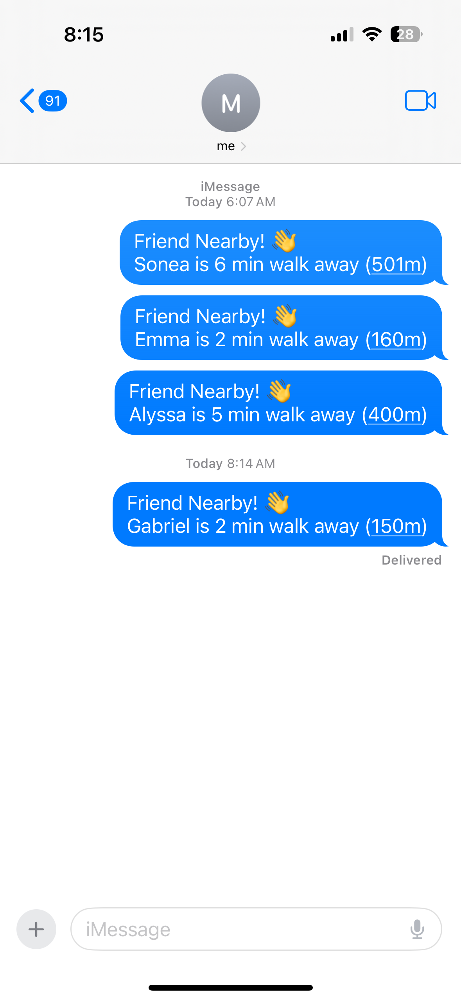
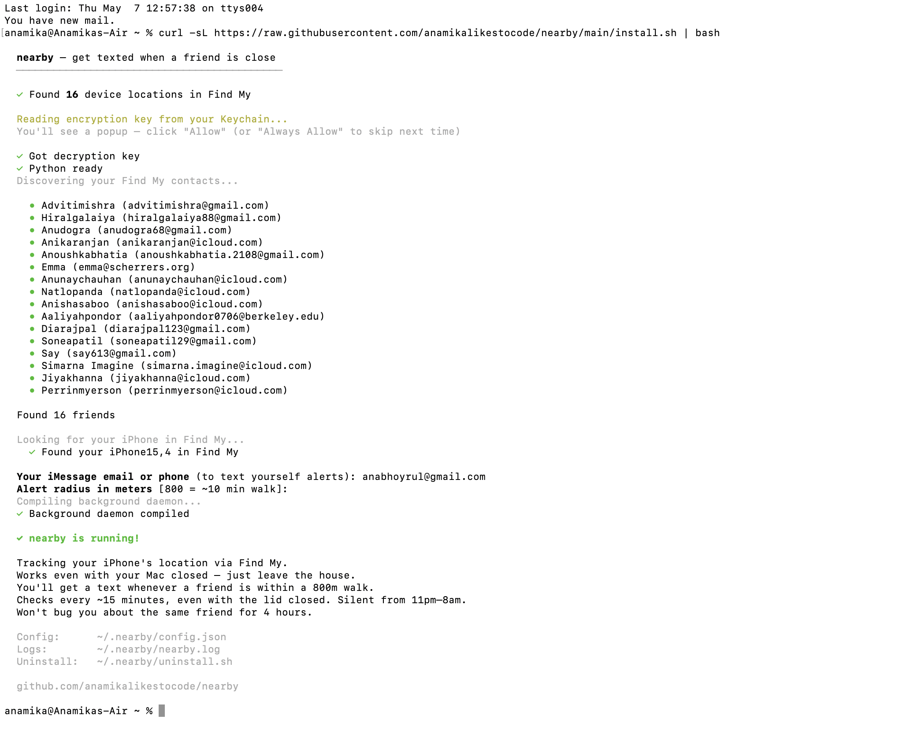

# nearby

**Get texted when a friend is within walking distance.**

Apple doesn't let you build on Find My — no API, no SDK, nothing. `nearby` is a workaround. It reads Find My's local cache on your Mac and texts you when a friend is close.

No app. No sign-up. No server. One terminal command.

```bash
curl -sL https://raw.githubusercontent.com/anamikalikestocode/nearby/main/install.sh | bash
```

<p align="center">
  
</p>

<p align="center">
  
</p>

## Why

> living in manhattan and having your friends locations on find my iphone makes the city feel like a big adult playground — [@anamika__x](https://x.com/anamika__x/status/2050656199901606390)

I kept checking Find My like a psychopath. So I automated it.

## How it works

1. Apple's `searchpartyd` daemon stores encrypted locations at `~/Library/com.apple.icloud.searchpartyd/`
2. This includes **your friends'** locations AND **your own iPhone's** GPS — all in the same cache
3. The encryption key (`BeaconStoreKey`) sits in your login Keychain — readable with one `security` command
4. Each `.record` file is AES-256-GCM encrypted: `[nonce, tag, ciphertext]`
5. `nearby` decrypts them, computes distances via haversine, and texts you via iMessage
6. Runs as a background daemon — silently, even with the lid closed. **Your data never leaves your Mac.**

**Works even with your laptop closed.** Your Mac reads your iPhone's GPS from Find My, so it knows where *you* are even when you're walking around. Close your laptop, leave the house — it keeps checking in the background.

## Install

```bash
curl -sL https://raw.githubusercontent.com/anamikalikestocode/nearby/main/install.sh | bash
```

Takes ~30 seconds. You'll click **Allow** on one popup (Keychain access), enter your iMessage address, and pick an alert radius. That's it — it's running.

<details>
<summary>What the install looks like</summary>

```
  nearby — get texted when a friend is close
  ───────────────────────────────────────────

  ✓ Found 16 device locations in Find My

  ✓ Got decryption key
  ✓ Python ready
  Discovering your Find My contacts...

    • Taylor (t*****@gmail.com)
    • Rohan (r*****@icloud.com)
    • Ashi (a*****@gmail.com)
    • Sonea (s*****@icloud.com)
    • Emma (e*****@gmail.com)
    • Priya (p*****@icloud.com)
    • Jake (j*****@gmail.com)

  Found 7 friends

  ✓ Found your iPhone15,4 in Find My
  ✓ Background daemon compiled

  ✓ nearby is running!

  Tracking your iPhone's location via Find My.
  Works even with your Mac closed — just leave the house.
  Checks every ~15 minutes, even with the lid closed.
```

</details>

## Requirements

- macOS 14+ (Sonoma)
- Signed into iCloud with Find My enabled
- At least one person sharing their location with you via Find My
- Python 3 (pre-installed on macOS)

## What you get

A text whenever a friend is close:

```
[09:14] 📍 iPhone GPS: 40.7497, -73.9760
[09:14] 🔔 Taylor is 5 min walk away (400m)
[09:14] 📱 iMessage sent
[09:30] ⏳ Taylor is 380m away (cooldown active)
[11:42] 🔔 Rohan is 2 min walk away (150m)
[11:42] 📱 iMessage sent
[14:15] 🔔 Ashi is 7 min walk away (580m)
[14:15] 📱 iMessage sent
[23:02] 💤 Rohan is 450m away but it's quiet hours
```

## Config

Edit `~/.nearby/config.json`:

| Setting | Default | Description |
|---|---|---|
| `radius_meters` | `800` | Alert distance (~10 min walk) |
| `cooldown_hours` | `4` | Don't re-alert about the same friend for this long |
| `quiet_start` | `23` | Silent after 11pm... |
| `quiet_end` | `8` | ...until 8am |

## Commands

```bash
python3 ~/.nearby/nearby.py           # run a manual check
cat ~/.nearby/nearby.log              # check logs
launchctl unload ~/Library/LaunchAgents/com.nearby.daemon.plist   # stop
launchctl load ~/Library/LaunchAgents/com.nearby.daemon.plist     # start
~/.nearby/uninstall.sh                # uninstall
```

## Privacy

- **Everything runs locally.** No server, no analytics, no telemetry.
- **You can only see people who already share their location with you** via Find My. This doesn't give you access to anyone new.
- **The encryption key never leaves your machine.** It's stored in `~/.nearby/config.json`, readable only by you.

## How the encryption works

Apple's Find My uses the [offline finding network](https://support.apple.com/en-us/HT210515) to locate devices via BLE beacons relayed through nearby Apple devices. Your Mac caches these locations as binary plists encrypted with AES-256-GCM.

The decryption key is a 32-byte symmetric key stored in your login Keychain under service `BeaconStore`. Readable with `security find-generic-password` — no SIP changes, no root, no hacks.

Each `.record` file is a plist array: `[nonce (16 bytes), tag (16 bytes), ciphertext]`. The decrypted payload contains `latitude`, `longitude`, `timestamp`, and a `findMyId` (base64 DSID identifying the device owner). Friend identities are resolved via `SecureLocationSharedKeys/` records.

## Uninstall

```bash
~/.nearby/uninstall.sh
```

Removes everything — the daemon, config, logs, and the `~/.nearby` directory.

## License

MIT

---

Built by [@anamika__x](https://x.com/anamika__x) — because your phone should tell you when friends are close.
